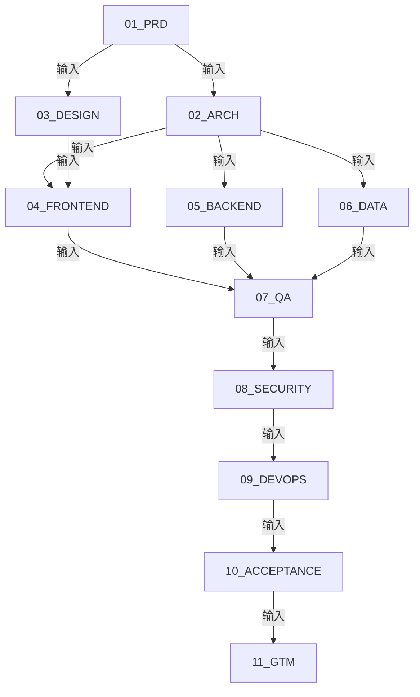

# 📚 ByteDance 国际商业化运营工具包 - 完整文档库

**从 MVP 到生产级的完整开发文档**

---

## 📋 文档目录

### Phase 1: 需求与设计阶段 (Week 1-2)

#### 01. 产品需求文档 (PRD)
- **文件**: `01_PRD/产品需求文档_PRD.md`
- **负责人**: 陈盈桦 (需求分析师)
- **状态**: ✅ 已完成
- **内容**: 产品定位、用户故事、功能清单、成功指标

#### 02. 系统架构设计
- **文件**: `02_ARCH/系统架构设计.md`
- **负责人**: 架构设计师
- **状态**: 🔄 进行中
- **内容**: 技术栈、架构图、数据库设计、API 设计

#### 03. UI/UX 设计规范
- **文件**: `03_DESIGN/UI设计规范.md`
- **负责人**: UI/UX 设计师
- **状态**: 🔄 进行中
- **内容**: 设计原则、组件库、交互规范、响应式设计

---

### Phase 2: 开发实施阶段 (Week 3-6)

#### 04. 前端实施计划
- **文件**: `04_FRONTEND/前端实施计划.md`
- **负责人**: 前端工程师
- **状态**: ⏳ 待开始
- **内容**: React 架构、组件开发、性能优化、测试计划

#### 05. 后端 API 规范
- **文件**: `05_BACKEND/后端API规范.md`
- **负责人**: 后端工程师
- **状态**: ⏳ 待开始
- **内容**: API 端点、数据模型、认证鉴权、第三方集成

#### 06. 数据管道设计
- **文件**: `06_DATA/数据管道设计.md`
- **负责人**: 数据工程师
- **状态**: ⏳ 待开始
- **内容**: ETL 流程、实时处理、数据质量、存储策略

---

### Phase 3: 质量保障阶段 (Week 7-8)

#### 07. 测试计划
- **文件**: `07_QA/测试计划.md`
- **负责人**: QA 测试工程师
- **状态**: ⏳ 待开始
- **内容**: 测试策略、测试用例、性能测试、兼容性测试

#### 08. 安全审计
- **文件**: `08_SECURITY/安全审计.md`
- **负责人**: 安全工程师
- **状态**: ⏳ 待开始
- **内容**: 威胁模型、安全检查、渗透测试、合规性

#### 09. 部署运维计划
- **文件**: `09_DEVOPS/部署运维计划.md`
- **负责人**: DevOps 工程师
- **状态**: ⏳ 待开始
- **内容**: CI/CD、监控体系、日志管理、备份恢复

---

### Phase 4: 验收与上线阶段 (Week 9-10)

#### 10. 产品验收标准
- **文件**: `10_ACCEPTANCE/产品验收标准.md`
- **负责人**: 产品验收团队
- **状态**: ⏳ 待开始
- **内容**: 功能验收、性能验收、安全验收、文档验收

#### 11. 市场推广计划 (GTM)
- **文件**: `11_GTM/市场推广计划.md`
- **负责人**: Marketing 团队
- **状态**: ⏳ 待开始
- **内容**: 产品定位、营销策略、销售策略、客户成功

---

## 🔄 文档依赖关系



---

## 📊 项目进度

| Phase | 进度 | 预计完成时间 |
|-------|------|-------------|
| Phase 1: 需求与设计 | 33% | Week 2 |
| Phase 2: 开发实施 | 0% | Week 6 |
| Phase 3: 质量保障 | 0% | Week 8 |
| Phase 4: 验收与上线 | 0% | Week 10 |

---

## 👥 团队成员

| 角色 | 姓名 | 负责文档 |
|------|------|---------|
| 需求分析师 | 陈盈桦 (Ian Chen) | 01_PRD |
| 架构设计师 | TBD | 02_ARCH |
| UI/UX 设计师 | TBD | 03_DESIGN |
| 前端工程师 | TBD | 04_FRONTEND |
| 后端工程师 | TBD | 05_BACKEND |
| 数据工程师 | TBD | 06_DATA |
| QA 测试工程师 | TBD | 07_QA |
| 安全工程师 | TBD | 08_SECURITY |
| DevOps 工程师 | TBD | 09_DEVOPS |
| 产品验收 | TBD | 10_ACCEPTANCE |
| Marketing | TBD | 11_GTM |

---

## 🎯 快速开始

### 1. 阅读顺序
如果你是新加入的团队成员,建议按以下顺序阅读文档:

1. **产品需求文档 (PRD)** - 了解产品定位和功能需求
2. **系统架构设计** - 了解技术栈和架构设计
3. **你的角色文档** - 深入了解你的工作内容

### 2. 文档规范
所有文档遵循以下规范:

- **格式**: Markdown (.md)
- **命名**: 中文名称_英文缩写.md
- **结构**: 标题层级清晰,包含目录
- **版本**: 使用 Git 管理版本
- **审批**: 需要相关负责人签字

### 3. 协作流程
```
1. 阅读上游文档 (依赖文档)
2. 编写自己的文档
3. 提交 Pull Request
4. 团队 Review
5. 合并到主分支
6. 通知下游团队
```

---

## 📞 联系方式

**项目负责人**: 陈盈桦 (Ian Chen)
- **邮箱**: [待补充]
- **电话**: 13398580812
- **GitHub**: [@emptyteabot](https://github.com/emptyteabot)

**文档问题反馈**: 请在 GitHub Issues 中提出

---

## 📝 更新日志

### 2026-02-16
- ✅ 创建文档目录结构
- ✅ 完成 PRD (产品需求文档)
- 🔄 开始架构设计和 UI 设计

---

**最后更新**: 2026-02-16
**文档版本**: v1.0
